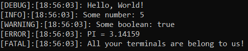
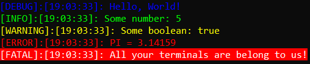
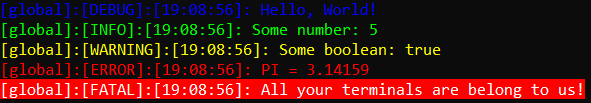

# rklog-cpp

**rklog-cpp** is a simple and easy-to-use logging library for C++, written in C++

## Examples

### Basic Logger
```cpp
#include <rklog/rklog.hpp>

int main()
{
    rklog::BasicLogger logger;
    logger.Debug("Hello, {}!", "World");
    logger.Info("Some number: {}", 5);
    logger.Warn("Some boolean: {}", true);
    logger.Error("PI = {}", 3.14159);
    logger.Fatal("All your terminals are belong to {}!", "us");
}
```
This yields the following:



### Color Logger
```cpp
#include <rklog/rklog.hpp>

int main()
{
    rklog::ColorLogger logger;
    logger.Debug("Hello, {}!", "World");
    logger.Info("Some number: {}", 5);
    logger.Warn("Some boolean: {}", true);
    logger.Error("PI = {}", 3.14159);
    logger.Fatal("All your terminals are belong to {}!", "us");
}
```
Yields the following:



### Global Logger
```cpp
#include "rklog/rklog.hpp"

int main()
{
    rklog::GetColorLogger().Debug("Hello, {}!", "World");
    rklog::GetColorLogger().Info("Some number: {}", 5);
    rklog::GetColorLogger().Warn("Some boolean: {}", true);
    rklog::GetColorLogger().Error("PI = {}", 3.14159);
    rklog::GetColorLogger().Fatal("All your terminals are belong to {}!", "us");
}
```
Yields the following:



**Note:** The presence of `global` in the output is considered the title of the logger. Each logger can optionally have a title.

## Features

- Basic (without color) logging to the terminal
- Colored logging to the terminal
- Logging to files via the `rklog::FileLogger` logger
- Global logging for ease of use
- Customizing the styles of each loggers output with the `rklog::LogStyle` and `rklog::LogConfig` classes

## Building

1. Clone the repository
```sh
git clone https://github.com/RCK1439/rklog-cpp.git
```

2. In the root directory of the project, run the following:
```sh
cmake -B build
```

3. Compile with the following command:
```sh
cmake --build build
```

This will build the project as a static library

## TODO

- As of the commit of this file, the project has yet to be tested on Linux and MacOS. Although the project should "theoretically" work on these platforms, they remain untested, so use at own risk
- Allowing for compilation as a dynamic library